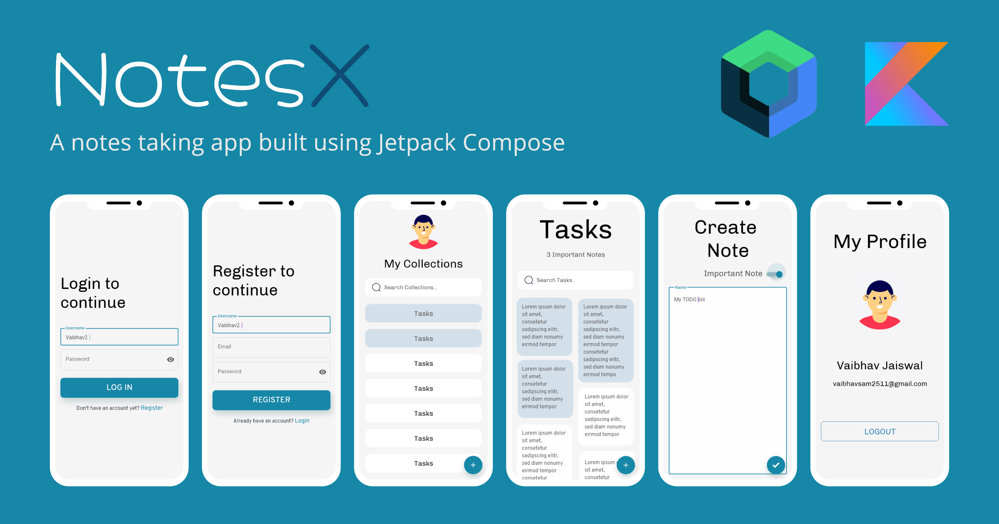
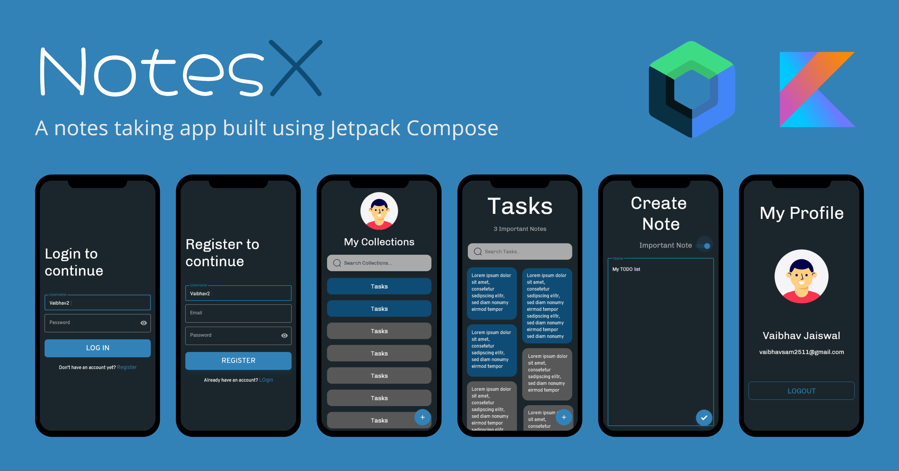
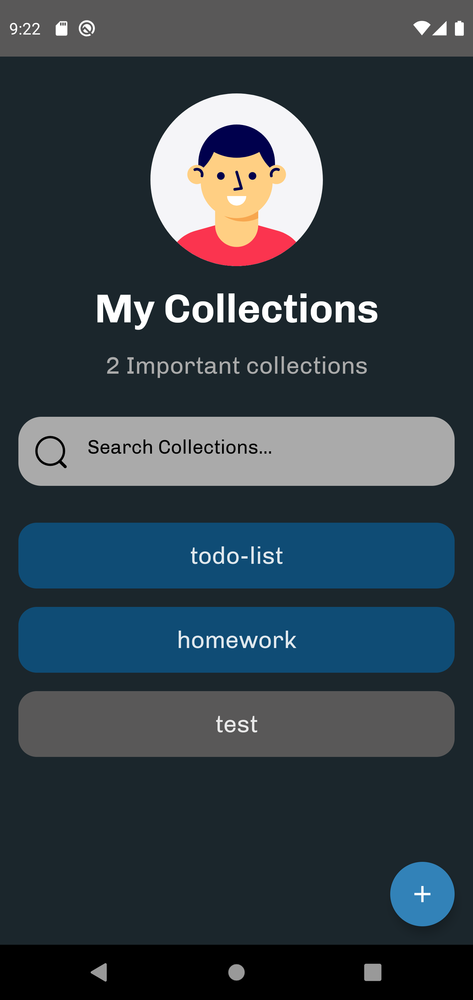
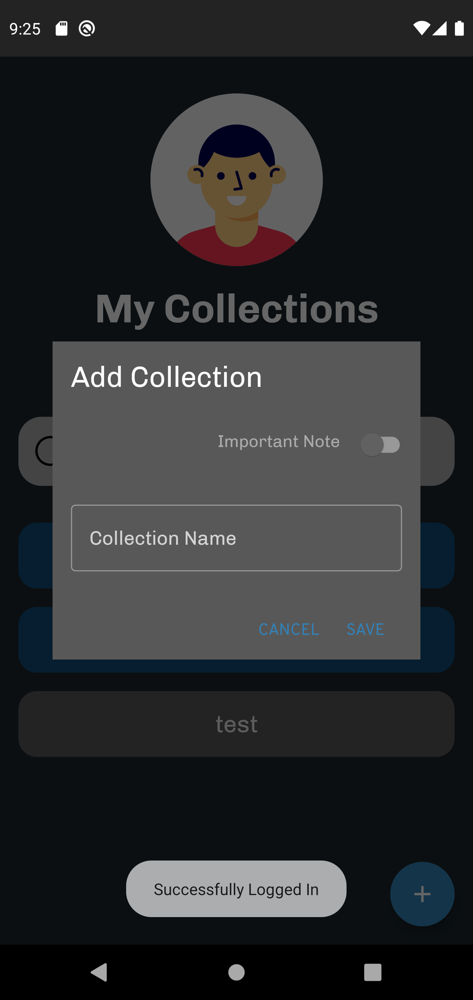
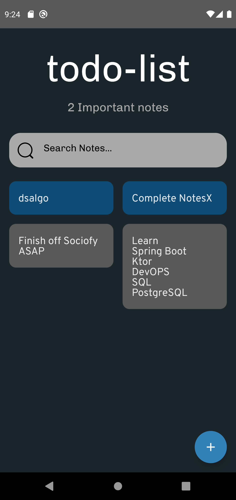
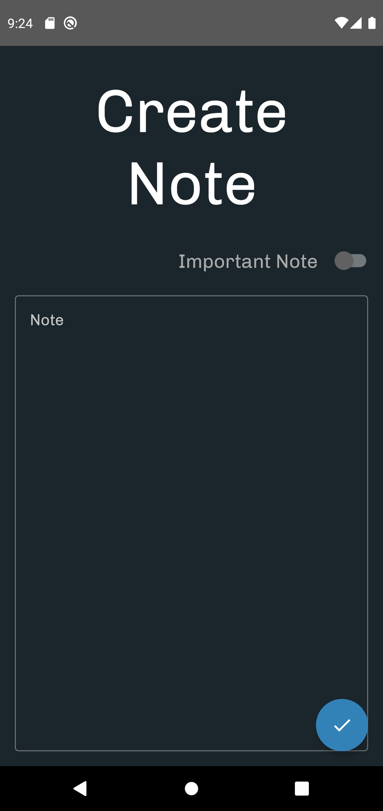
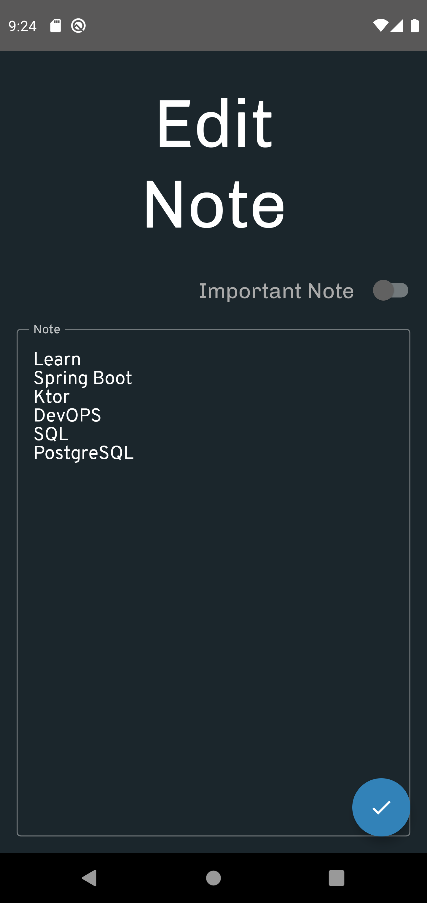

# **NotesX** 

**NotesX** is a note taking Android application 📱 built using [Jetpack Compose](https://developer.android.com/jetpack/compose) and also to demonstrate use of *Modern Android development* tools.

***You can Install and test latest NotesX app from below 👇***

## Setup
Clone the repository on your machine. Open the project on your IDE and connect it to your backend and everything will be set up.
You can get the Spring Boot backend code from https://github.com/Vaibhav2002/Spring-Boot-Notes-REST-API

## About

 It uses my custom Spring Boot Backend. It is build purely on Jetpck Compose and follows the best android development practices.

- Fully functionable. 
- Clean and Simple Material UI.
- It supports dark theme too 🌗.

## 📸 Screenshots

||||
|:----------------------------------------:|:-----------------------------------------:|:-----------------------------------------: |
|  |  |  |
|  |  |  |
|  |  |  |

## Built With 🛠
- [Kotlin](https://kotlinlang.org/) - First class and official programming language for Android development.
- [Coroutines](https://kotlinlang.org/docs/reference/coroutines-overview.html) - For asynchronous and more..
- [Android Architecture Components](https://developer.android.com/topic/libraries/architecture) - Collection of libraries that help you design robust, testable, and maintainable apps.
  - [LiveData](https://developer.android.com/topic/libraries/architecture/livedata) - Data objects that notify views when the underlying database changes.
  - [ViewModel](https://developer.android.com/topic/libraries/architecture/viewmodel) - Stores UI-related data that isn't destroyed on UI changes. 
  - [MutableState](https://developer.android.com/jetpack/compose/state) - A Data Structure which is widely used when developing ui in Jetpack Compose
  - [Room](https://developer.android.com/training/data-storage/room) - The Room persistence library provides an abstraction layer over SQLite to allow fluent database access while harnessing the full power of SQLite.
- [Dependency Injection](https://developer.android.com/training/dependency-injection) - 
  - [Hilt-Dagger](https://dagger.dev/hilt/) - Standard library to incorporate Dagger dependency injection into an Android application.
  - [Hilt-ViewModel](https://developer.android.com/training/dependency-injection/hilt-jetpack) - DI for injecting `ViewModel`.
- [Backend](https://github.com/Vaibhav2002/Spring-Boot-Notes-REST-API) - my custom Spring Boot Backend
- [Retrofit](https://square.github.io/retrofit/) - A type-safe HTTP client for Android and Java.
- [GSON](https://github.com/google/gson) - A modern JSON library for Kotlin and Java.
- [Timber](https://github.com/JakeWharton/timber) - A simple logging library for android.
- [GSON Converter](https://github.com/square/retrofit/tree/master/retrofit-converters/gson) - A Converter which uses Moshi for serialization to and from JSON.
- [Glide](https://github.com/bumptech/glide) - An image loading library for Android backed by Kotlin Coroutines.
- [Material Components for Android](https://github.com/material-components/material-components-android) - Modular and customizable Material Design UI components for Android.

# Package Structure
    
    com.vaibhav.notesX    # Root Package
    .
    ├── data                # For data handling.
    │   ├── local           # Classes for Room  
    │   ├── models          # Model Data Classes
    │   ├── remote          # Classes For Retrofit
    |   ├── repo            # Single source of thruth
    |   └── util            # utility classes
    |
    ├── di                  # Dependency Injection             
    │   └── module          # DI Modules
    |
    ├── ui                  # UI/View layer
    │   ├── composables     # All composables
    │   ├── theme           # Main app theme
    |   └── viewmodels      # All ViewModels
    |   
    └── utils               # Utility Classes / Kotlin extensions

## Architecture
This app uses [***MVVM (Model View View-Model)***](https://developer.android.com/jetpack/docs/guide#recommended-app-arch) architecture.

 ## Contact
If you need any help, you can connect with me.

Visit:- [VaibhavJaiswal.io](https://vaibhav2002.github.io)
  

